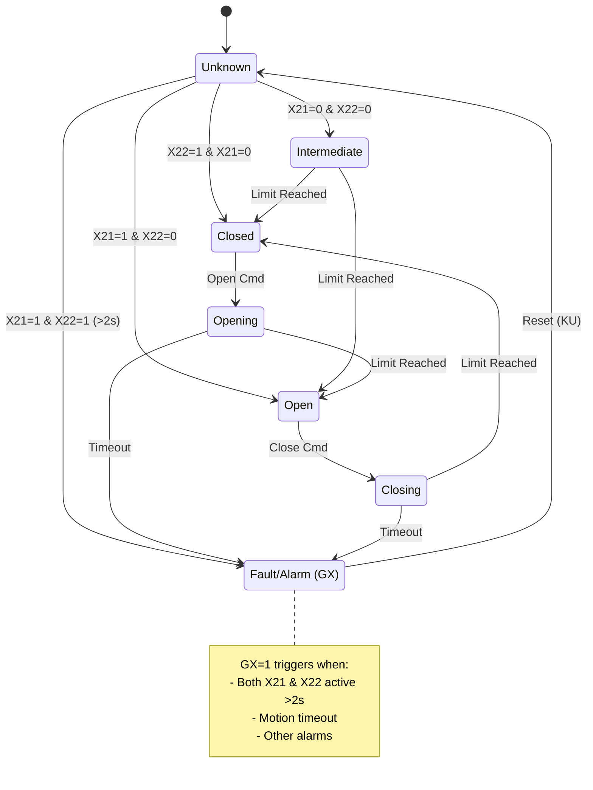

# FB_MOV01 - Motor Operated Valve Control

This function block implements the control logic for a Motor Operated Valve (MOV). It handles manual and automatic commands, monitors limit switches, manages faults, and supports a simulation mode.

## Description

The `FB_MOV01` block controls a valve actuator. It processes open, close, and stop commands while monitoring feedback from limit switches (`X21`, `X22`) and fault signals (`X43`). It includes timers to detect motion failures (e.g., "Failed to Open", "Failed to Close") and generates status flags for HMI visualization.

## Interface

### Inputs

| Name | Type | Description | Logic Note |
|---|---|---|---|
| `X21` | Bool | Open Limit Switch | 1 = Active (Open), 0 = Inactive |
| `X22` | Bool | Closed Limit Switch | 1 = Active (Closed), 0 = Inactive |
| `X43` | Bool | Torque Switch / Thermal Overload / Availability | 1 = OK |
| `X23` | Bool | Remote/Local Selector | 1 = Remote |
| `X15` | Bool | Stop Pushbutton / Interlock (Debounced) | |
| `EAO` | Bool | External Auto Open Command | |
| `EAC` | Bool | External Auto Close Command | |
| `EWO` | Bool | External Warning Open (Interlock?) | |
| `EWC` | Bool | External Warning Close (Interlock?) | |
| `SFLT` | Bool | System Fault (SIL Safety) | |
| `PAZ` | Bool | Emergency Protection Trip | |

**Note on Limit Switches:** The block supports both **Normally Open (NO)** and **Normally Closed (NC)** wiring:

**Standard NO Logic (Active = 1):**
- `X21=0`, `X22=0` -> **Intermediate** Position (Valve in travel).
- `X21=1`, `X22=0` -> Fully **Open**.
- `X21=0`, `X22=1` -> Fully **Closed**.
- `X21=1`, `X22=1` -> **Fault** after 2s (`GX`, `GSL`) - Invalid state.

**Fail-Safe NC Logic (Normally Closed contacts, typically used to detect power loss):**
- `X21=1`, `X22=1` -> **Intermediate** Position (Both switches NOT pressed, contacts closed).
- `X21=0`, `X22=1` -> Fully **Open** (Open switch pressed, contact opened).
- `X21=1`, `X22=0` -> Fully **Closed** (Closed switch pressed, contact opened).
- `X21=0`, `X22=0` -> **Power Loss / Wire Break** (Shows as Intermediate initially, then may trigger other alarms).

**Fault Detection:** If both `X21=1` AND `X22=1` persist for more than 2 seconds, the timer `T_ON01` triggers, setting:
- `GX = 1` (Fault - Undefined State)
- `GSL = 1` (Alarm - Both Limit Switches Active)

This allows the block to detect wiring faults, stuck switches, or (when using NC contacts) simultaneous activation.

### Outputs

| Name | Type | Description |
|---|---|---|
| `Y31` | Bool | Open Command Output (to Contactor) |
| `Y32` | Bool | Close Command Output (to Contactor) |
| `Y33` | Bool | Stop Command Output / Healthy Signal |
| `GO` | Bool | Status: Fully Open |
| `GC` | Bool | Status: Fully Closed |
| `GR` | Bool | Status: Running (Moving) |
| `GNO` | Bool | Alarm: General Not Opened (Fault) |
| `GNC` | Bool | Alarm: General Not Closed (Fault) |
| `GF` | Bool | General Fault |
| `GSL` | Bool | Alarm: Both Limit Switches Active (Internal, packed in GW2) |
| `WO` | Bool | Warning: Open Inhibited |
| `WC` | Bool | Warning: Close Inhibited |
| `GMD` | Bool | Status: Remote Mode Active |

### In-Out / Static

| Name | Type | Description |
|---|---|---|
| `GW1` | DWord | Status Word 1 (Packed for HMI/SCADA) |
| `GW2` | DWord | Status Word 2 (Packed for HMI/SCADA) |
| `KMJ` | Bool | Simulation Mode Enable |

## Logic Flow

The block logic is divided into sequential steps:

1.  **Mode Selection**: Determines if the valve is in Local, Remote (`GMD`), or Simulation (`KMJ`) mode.
2.  **State Monitoring**: Evaluates limit switches `X21`/`X22` to determine if Open (`GO`), Closed (`GC`), or Intermediate (`GI`).
3.  **Open Command**: Processes open requests. Checks interlocks (`WO`). Sets `Y31`.
4.  **Close Command**: Processes close requests. Checks interlocks (`WC`). Sets `Y32`.
5.  **Motion Verification (Open)**: Monitors if the valve is moving towards Open. Triggers alarms if movement is not detected or timeout occurs.
6.  **Motion Verification (Close)**: Monitors if the valve is moving towards Close.
7.  **Stop Command**: Handles Stop requests. Resets outputs.
8.  **Stop Verification**: Confirms stop state.
9.  **Simulation**: Logic to simulate valve movement when `KMJ` is active (bypassing physical I/O).
10. **Mask Calculation**: Updates permission masks for Open/Close operations.
11. **Timers & Alarms**:
    -   `T_ON05`: Opening Time Limit (Alarm `GNO4`).
    -   `T_ON09`: Closing Time Limit (Alarm `GNC4`).
    -   `T_ON04` / `T_ON08`: Movement start check (did it leave the limit switch?).
    -   `T_ON14`: Alarm Reset Timer.
12. **Packing**: Encodes boolean statuses into `GW1` and `GW2` for SCADA.
13. **HMI State**: Calculates an integer state `ST` for graphical representation (color/animation).

## State Diagram

The following diagram illustrates the basic transition logic between states:

## Status Words (GW1)

The `FC_PACKDWORD` function packs individual bits into `GW1`.

| Bit | Variable | Meaning |
|---|---|---|
| 0 | KC | Command Close |
| 1 | KS | Command Stop |
| 2 | KO | Command Open |
| ... | ... | ... |
| 7 | GC | Status Closed |
| 8 | GO | Status Open |
| ... | ... | ... |
| 21 | GWK | Waiting Command |

## Timers

| Timer Instance | Time Parameter | Default Value | Description |
|---|---|---|---|
| `T_ON01` | `T_05` | 2s | Undefined state monitoring |
| `T_ON02` | `T_01` | 5s | Reverse delay (Opening) |
| `T_ON03` | `T_01` | 5s | Reverse delay (Closing) |
| `T_ON04` | `T_02` | 2s | Movement check (Leaving Closed limit) |
| `T_ON05` | `T_03` | 5m | Max Opening Time (Full travel) |
| `T_ON06` | `T_06` | 2s | Signal loss monitoring |
| `T_ON07` | `T_01` | 5s | Opening Start Delay |
| `T_ON08` | `T_02` | 2s | Movement check (Leaving Open limit) |
| `T_ON09` | `T_04` | 5m | Max Closing Time (Full travel) |
| `T_ON14` | `T_07` | 2s | Alarm Reset Delay |

